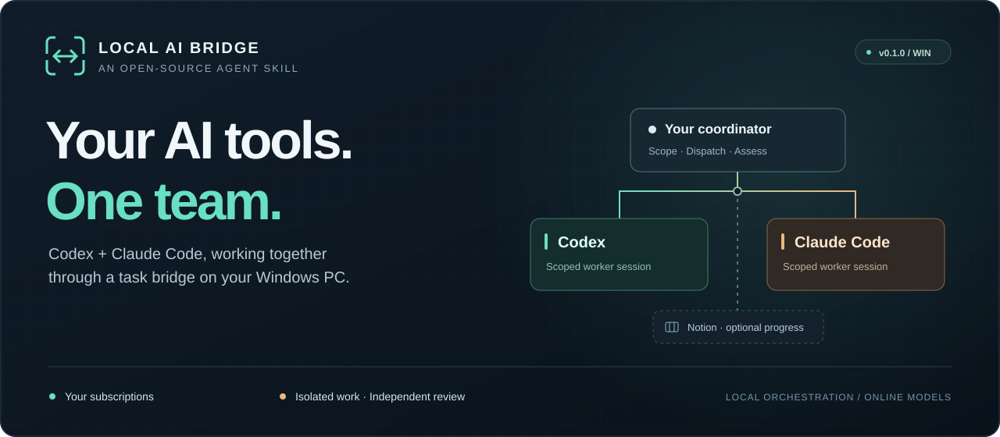
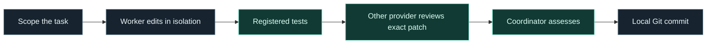

<p align="center">
  
</p>

<p align="center">
  <a href="https://github.com/BlacklistALG/local-ai-bridge/releases/tag/v0.1.0"></a>
  
  
  <a href="VALIDATION.md"></a>
  <a href="LICENSE"></a>
</p>

<h3 align="center">One brief. Two coding assistants. A reviewable result.</h3>

<p align="center">Coordinate <b>Codex + Claude Code</b> on your Windows PC using your own eligible subscriptions.<br>Give each worker a clear task, keep changes isolated, and bring the results back for review.</p>

<p align="center">
  <a href="https://github.com/BlacklistALG/local-ai-bridge/releases/download/v0.1.0/local-ai-bridge-v0.1.0.zip"><b>Download v0.1.0 ↗</b></a>
  &nbsp; · &nbsp;
  <a href="#get-started">Get started</a>
  &nbsp; · &nbsp;
  <a href="references/workflow.md">Workflow guide</a>
  &nbsp; · &nbsp;
  <a href="VALIDATION.md">Validation</a>
</p>

---

## A small AI department, on your terms

Your assistants bring different perspectives. Local AI Bridge gives them a shared task queue and a consistent way to hand off work. Choose a coordinating assistant, define the work, and let separate Codex and Claude Code sessions tackle scoped jobs.

<table>
<tr>
<td width="50%" valign="top">
<h3>◈ Two workers, one queue</h3>
Run one worker from each provider simultaneously by default. Separate sessions and task folders keep assignments distinct; dependencies carry accepted results forward.
</td>
<td width="50%" valign="top">
<h3>◇ Build, then cross-review</h3>
Let Codex implement and Claude review, or reverse the roles. Editing uses isolated Git worktrees, explicit file scopes, registered tests, and review of the exact patch.
</td>
</tr>
<tr>
<td valign="top">
<h3>▦ See progress in Notion</h3>
Optionally mirror task progress to your own board through a dedicated OAuth connection and background watcher. The local queue remains the source of truth.
</td>
<td valign="top">
<h3>◎ Make the team yours</h3>
Configure roles, supported model IDs, executable paths, trusted projects, and board IDs. Use your own subscriptions, with no paid model API fallback.
</td>
</tr>
</table>

## From assignment to an accepted change



**Worker finished ≠ task accepted.** A completed worker result enters review. The coordinator assesses the evidence before acceptance or integration. A changed patch needs fresh tests and review; integration creates a local commit. Pushing and deployment remain separate actions.

> **Example workflow:** Ask the coordinator to scope a bug fix. A Codex worker makes the change in an isolated worktree. Registered tests run. A Claude worker reviews that exact patch against the acceptance criteria. The coordinator assesses the result before local integration.

## Get started

**You need:** Windows · Node.js 22+ · native Codex and Claude Code CLIs · eligible subscription sign-ins. Git for Windows is needed for project editing. Desktop chat apps alone are not enough.

### 1 · Download and extract

Get the [release ZIP](https://github.com/BlacklistALG/local-ai-bridge/releases/download/v0.1.0/local-ai-bridge-v0.1.0.zip). Keep the entire `local-ai-bridge` folder together: it contains the skill, runtime, guides, and tests.

### 2 · Ask your assistant to set it up

Install the folder through your host's supported local skill flow, then use this prompt in an assistant with local command and file access:

```text
Use $local-ai-bridge to set up Codex and Claude teamwork using my
existing subscriptions. Keep Notion optional and start with read-only tasks.
```

Prefer manual setup? Run this from the extracted folder:

```powershell
node scripts/setup.mjs --destination 'D:\AI-Workspace\my-bridge'
```

### 3 · Connect your own team

Follow the [setup guide](references/setup.md) to configure your executables and supported models, confirm subscription billing settings, and verify a small read-only handoff. Add [project editing](references/workflow.md) and [Notion](references/notion.md) when ready.

The installer creates a **new private folder outside the skill**, refuses overwrites, and starts with editing and Notion disabled. It does not invoke models or start a service. No `npm install` is needed.

## What is supported today?

| Component | In this release |
| :--- | :--- |
| **Codex + Claude Code** | Native CLI workers on Windows; your own eligible subscription sign-ins |
| **Coordinating assistant** | Scopes and dispatches tasks, assesses results, decides follow-up work |
| **Notion** | Optional OAuth connection and progress watcher for your board |
| **Grok / other entry assistants** | Can use the bridge only when they have authorized local command access; no bundled Grok worker adapter |
| **Execution** | Local orchestration with online models; the PC must be awake and connected |

<details>
<summary><b>Read the boundaries before your first run</b></summary>

- Included subscription limits still apply. Extra usage settings belong to each provider; the bridge records your confirmation but cannot guarantee account billing behavior.
- There is no automatic planner loop, recursive agent delegation, shared desktop-chat memory, or unsolicited callback to Grok.
- This release does not install a Windows startup service. macOS, Linux, and cloud-only chats are outside the supported setup.
- Runtime configuration and registered tests are trusted local code. Worktrees and scope checks are not a virtual-machine security boundary.
- Each new installation must verify its own account access, CLI compatibility, models, and optional Notion connection.

</details>

## Built, exercised, and documented

| Release evidence | What it establishes |
| :--- | :--- |
| **118 automated tests passed** | Runtime and setup checks, with simulated provider and Notion responses |
| **Live handoff pilots** | The originating private installation completed Codex-to-Claude and Claude-to-Codex edit/review/integration workflows |
| **Notion progress verified** | Automatic card creation and status propagation in the originating private installation |
| **Independent setup evaluation** | Fresh installation, safe defaults, overwrite refusal, and local diagnostic checks |

See [validation details and limits](VALIDATION.md). These results describe the tested setup; they do not establish compatibility with every account or machine.

## Find your next step

| I want to… | Open this |
| :--- | :--- |
| Set up my assistants | [First-time setup](references/setup.md) |
| Assign, review, and integrate work | [Task coordination](references/workflow.md) |
| See progress on my board | [Notion setup](references/notion.md) |
| Diagnose a blocked task | [Recovery and limitations](references/troubleshooting.md) |
| Understand the agent instructions | [The skill](SKILL.md) |
| Report a reproducible problem or suggest an improvement | [GitHub Issues](https://github.com/BlacklistALG/local-ai-bridge/issues) |

<details>
<summary><b>For contributors and people sharing the bridge</b></summary>

Share the clean skill source or release ZIP. **Never publish a private runtime installation:** it can contain credentials, configuration, queue history, and project work. Remove those details from issue reports too.

Before redistributing changes, review the files and run:

```powershell
node scripts/check-release.mjs
node --test scripts/setup.test.mjs scripts/bridge/tests/*.test.mjs
```

The release checker supplements human review. Format references: [Agent Skills](https://agentskills.io/specification), [OpenAI skills](https://developers.openai.com/plugins/build/skills), and [Claude Code skills](https://code.claude.com/docs/en/skills).

</details>

---

<p align="center"><b>Your tools. Your accounts. Your workflow.</b><br><sub>Windows reference release · MIT licensed · Community project<br>Not affiliated with OpenAI, Anthropic, xAI, or Notion. GitHub distribution; no marketplace approval claimed.</sub></p>
